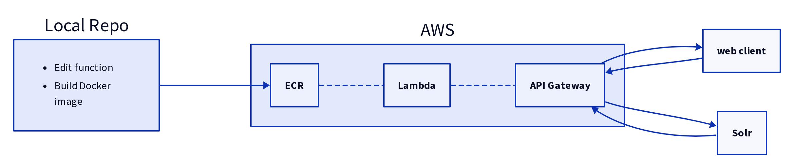

# Search Plugin

_Function, but still in development..._

This application creates an endpoint that can be used by GeoBlacklight instances in place of the default `SOLR_URL` environment variable. Hitting this endpoint with a `GET` request that has a `q` (query) parameter will engage `nltk` to expand the query terms and pass this expanded query on to Solr. Any other request will pass right through this function unaltered. When a response is received from Solr, it is passsed back to the client.



## Build and push image to ECR

### Install and Configure AWS

_To do: What exactly are the necessary credentials?_

You must create an AWS user with the proper credentials, then use these credentials to configure your AWS CLI.

```bash
aws configure
```

### Login to ECR

_To do: clarify what password is used..._

```bash
aws ecr get-login-password --region us-east-2 | docker login --username AWS --password-stdin <account number?>.dkr.ecr.us-east-2.amazonaws.com
```

### Creating AWS ECR Repository

_Only needed on first deployment._

```bash
aws ecr create-repository \
    --repository-name geoblacklight-search-plugin \
    --region us-east-2
```

### Creating Docker Build

```bash
docker build -f ./ecr.dockerfile -t lambda_nltk .
```

-t is the image name

## Adding Tag to the Docker Build
```bash
docker tag lambda_nltk:latest <account number?>.dkr.ecr.us-east-2.amazonaws.com/geoblacklight-search-plugin
```

## Pushing the Build to AWS


```bash
docker push <account number?>.dkr.ecr.us-east-2.amazonaws.com/geoblacklight-search-plugin
```

### Single command for edited rebuild

```
docker build -f ./ecr.dockerfile -t lambda_nltk . && \
   docker tag lambda_nltk:latest <account number?>.dkr.ecr.us-east-2.amazonaws.com/geoblacklight-search-plugin && \
   docker push <account number?>.dkr.ecr.us-east-2.amazonaws.com/geoblacklight-search-plugin
```

### References

[AWS Documentation](https://docs.aws.amazon.com/AmazonECR/latest/userguide/getting-started-cli.html)
